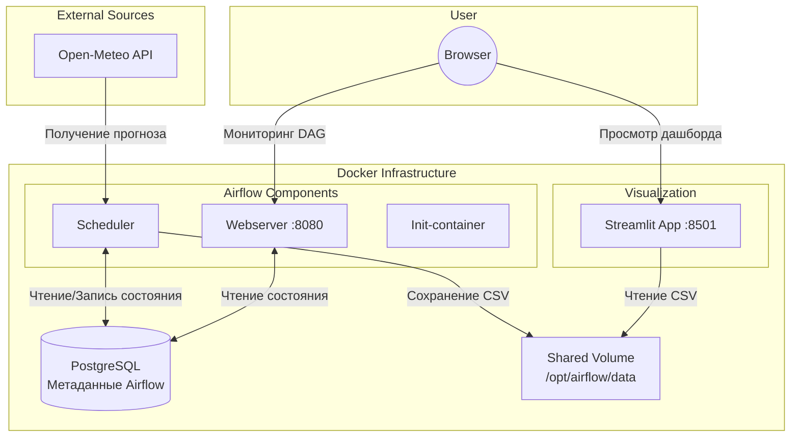

# Проектный практикум по разработке ETL-решений: Лабораторная работа №5. Вариант 13

## Постановка задачи (Вариант 20)
Разработать контейнеризированное ETL-решение на базе Apache Airflow для автоматизации пайплайна обработки данных со следующими требованиями:

| Вариант | Задание 1 (Сбор данных) | Задание 2 (Трансформация) | Задание 3 (Сохранение/Визуализация) |
|---|---|---|---|
| 13 | Прогноз: Прага, 3 дня | Столбец: дельта с пред. днём | Таблица изменений |

---

## Архитектура проекта

## Технический стек
* **Оркестрация:** Apache Airflow 2.8.1
* **Контейнеризация:** Docker, Docker Compose
* **Язык программирования:** Python 3.11
* **Библиотеки (ETL & ML):** Pandas, Scikit-learn, Joblib, Requests
* **Визуализация:** Streamlit, Matplotlib
* **База данных:** PostgreSQL 12 (для метаданных Airflow)

## Описание DAG (`real_umbrella_prague`)
Пайплайн состоит из следующих задач (Task):
1. **`fetch_weather_forecast`**: Обращается к Open-Meteo API, получает прогноз для **Праги** на 3 дня, сохраняет в `weather_forecast.csv`.
2. **`clean_weather_data`**: Заполняет пропуски, вычисляет и **добавляет столбец "дельта с предыдущим днем"** (разница температур между текущим и предыдущим днем), сохраняет в `clean_weather.csv`.
3. **`fetch_sales_data`**: Читает даты из прогноза погоды и генерирует моковые данные о продажах на эти же даты (чтобы `join` отработал корректно), сохраняет в `sales_data.csv`.
4. **`clean_sales_data`**: Очищает данные продаж методом forward fill, сохраняет в `clean_sales.csv`.
5. **`join_datasets`**: Объединяет данные о погоде и продажах по дате (Inner Join), сохраняет в `joined_data.csv`.
6. **`create_changes_table`**: Создает **таблицу изменений** на основе объединенных данных, добавляет столбцы: тип изменения температуры (increase/decrease/no_change), абсолютное значение дельты, изменение продаж и его тип, сохраняет в `changes_table.csv`.
7. **`train_ml_model`**: Обучает модель линейной регрессии для предсказания продаж на основе двух признаков: температуры и дельты температуры, сохраняет модель в `ml_model.pkl`.
8. **`deploy_ml_model`**: Имитирует деплой (загружает сохраненную `.pkl` модель) и демонстрирует предсказания на основе таблицы изменений.

## Структура выходных данных
После выполнения DAG в директории `/opt/airflow/data` формируются файлы
