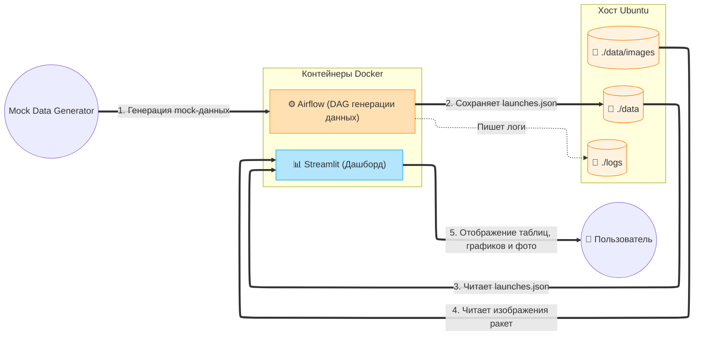

# Лабораторная работа №5.2. Разработка алгоритмов для трансформации данных. Бизнес-кейс «Rocket». Вариант 13

**Цель работы:**
-  Закрепить навыки развертывания Apache Airflow в контейнеризированной среде (Docker).
-  Изучить работу с JSON-данными и бинарным контентом (изображениями) внутри ETL-процесса.
-  Научиться проектировать архитектуру ETL-решений и визуализировать её.
-  Автоматизировать выгрузку результатов работы DAG из контейнера в хост-систему.

| Вариант | Задание 1 (Анализ/ETL) | Задание 2 (Обработка/Логика) | Задание 3 (Отчетность/Метрики) |
|:---:|---|---|---|
| 13 | Отчет. Список ракет и их изображений | Загрузка с альтернативных источников (mock) | Анализ типов исключений (HTTP errors) |

---

## Диаграмма архитектуры

