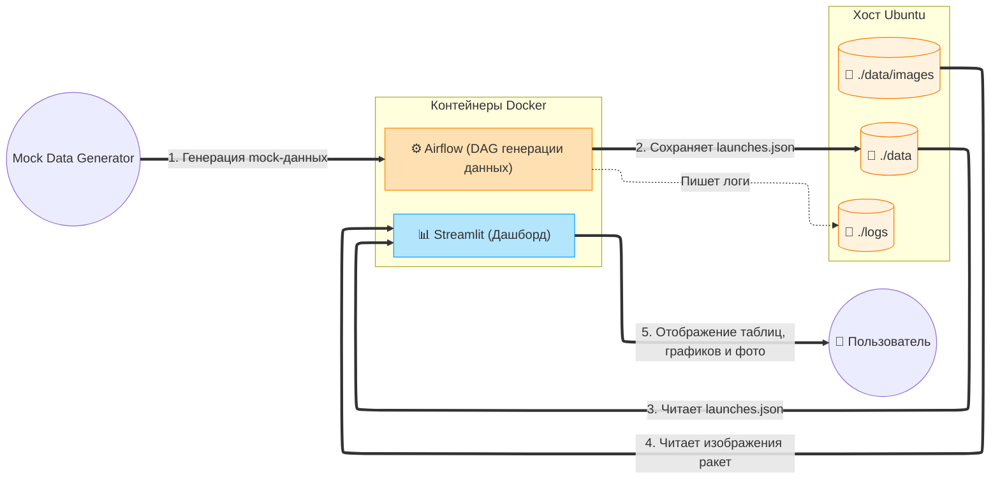

# Лабораторная работа №5.2. Разработка алгоритмов для трансформации данных. Бизнес-кейс «Rocket». Вариант 13

**Цель работы:**
-  Закрепить навыки развертывания Apache Airflow в контейнеризированной среде (Docker).
-  Изучить работу с JSON-данными и бинарным контентом (изображениями) внутри ETL-процесса.
-  Научиться проектировать архитектуру ETL-решений и визуализировать её.
-  Автоматизировать выгрузку результатов работы DAG из контейнера в хост-систему.

| Вариант | Задание 1 (Анализ/ETL) | Задание 2 (Обработка/Логика) | Задание 3 (Отчетность/Метрики) |
|:---:|---|---|---|
| 13 | Отчет. Список ракет и их изображений | Загрузка с альтернативных источников (mock) | Анализ типов исключений (HTTP errors) |

---

## Диаграмма архитектуры



### Пояснение к архитектуре

Архитектура построена по принципу микросервисов с общим разделяемым хранилищем (Shared Volumes). Это позволяет сервисам быть независимыми, но при этом легко обмениваться файлами без сложной сетевой пересылки.

**Архитектура директорий:**
```text
.
├── app/                  # Скрипты Streamlit (app.py)
├── dags/                 # Airflow DAGs (download_rocket_launches.py)
├── data/                 # Локальная папка для JSON, фото
├── logs/                 # Логи Airflow (доступны напрямую из хоста)
├── docker-compose.yml    
└── Dockerfile            
```
---

## Шаги по запуску окружения (Ubuntu 22.04)

### 1. Подготовка инфраструктуры

```bash
# Создание необходимых папок
mkdir -p dags data logs app

# Установка правильных прав доступа для Airflow (UID 50000)
# Это ВАЖНО, чтобы Airflow мог писать файлы в папки data и logs
sudo chown -R 50000:0 data logs
sudo chmod -R 775 data logs
```
Результат:


### 2. Сборка и запуск Docker Compose
```bash
# Сборка кастомного образа с ML и Streamlit
sudo docker build -t custom-airflow:slim-2.8.1-python3.11 .
# Запуск инфраструктуры в фоновом режиме
sudo docker compose up -d
```
Результат:


### 3. Выполнение ETL (Airflow)

Открываю браузер по адресу: http://localhost:8080

Ввожу логин и пароль: admin / admin

Нахожу DAG download_rocket_launch, включаю его (Unpause) и запускаю (Trigger DAG)

Проверяю, что в папке ./data/images/ появились фотографии, а файл ./data/launches.json скачан


### 4. Просмотр аналитики (Streamlit)
Streamlit запускается автоматически в Docker-контейнере.
в раузере по адресу: `http://localhost:8501`

Здесь представлен отчет со статистикой запусков и галереей изображений:


---

## Вывод

В ходе выполнения лабораторной работы я закрепила навыки развертывания Apache Airflow в Docker-контейнерах. Был реализован ETL-процесс для генерации mock-данных о запусках ракет, включающий загрузку JSON-файла с информацией о запусках и сохранение изображений ракет в локальную папку. 

Были выполнены задачи:
- формирование отчёта со списком ракет и их изображений;
- загрузку данных из альтернативного mock-источника;
- анализ типов исключений (HTTP errors).
